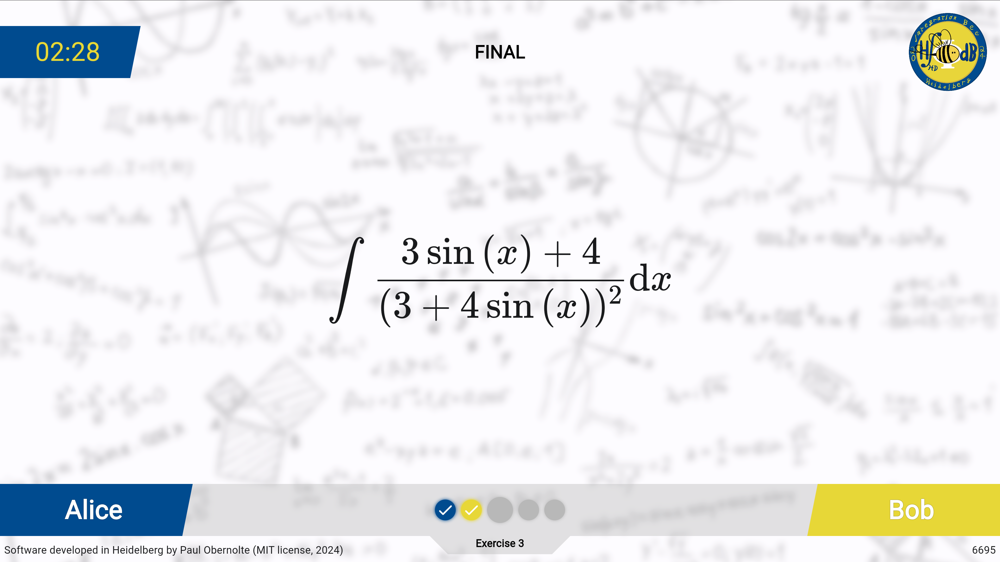
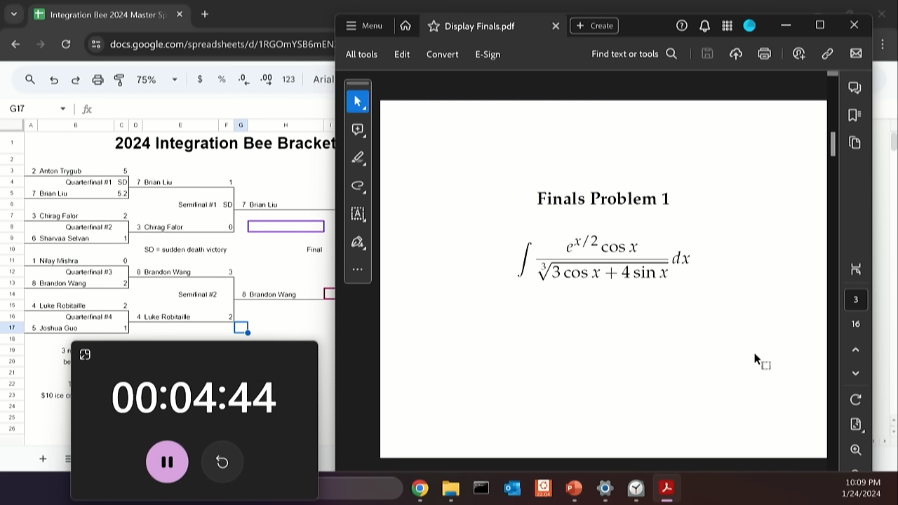
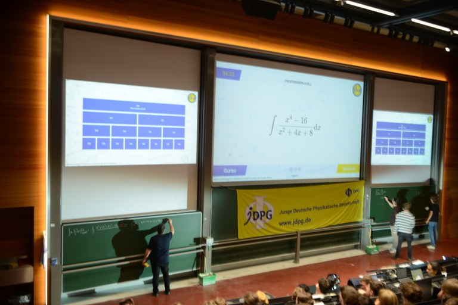

    
    <h1 align="center">Integration Bee Helper</h1>
    
<b>State of the art software to host integration bees.</b>

    
Open source. Developed by Paul Obernolte in Heidelberg.
 

## What?

- An <b>Integration Bee</b> is a fun competition amongst students to find out who is best in solving integrals. Usually, it is hosted in a big lecture hall with hundreds of spectators.
- The competition format was initially invented at the MIT, but soon adopted at many universities around the world – amongst others [in Heidelberg](https://www.youtube.com/watch?v=NPV4zvshbvQ&t=9737s).
- The <b>Integration Bee Helper</b> (this software) can help the organizers of such a competition to plan and carry out the event.
- However, the software might be suitable for a wide range of exercise-based competition formats. (How about an IUPAC naming competition for chemistry students? ;-))

## Direct comparison

    
    
How MIT manages <a href="https://www.youtube.com/watch?v=dyfLMHGnPR0">their integration bee</a>. :-(

    
    
How the Heidelberg Integration Bee is managed using this software. :-)

    
© DPG / Klioba 2024

## How to use

There are two ways to use this software:

1. Clone this repository and set the software up yourself. This might require slight knowledge of [Flutter](https://flutter.dev) and [Firebase](https://firebase.google.com).
2. Just go to [https://paul019.github.io/integration_bee_helper/](https://paul019.github.io/integration_bee_helper/) and sign up.

## Features

Placeholder

## Contact

Please feel free to [write me an email](mailto:p-ob@web.de) or to open an issue in GitHub. Contributions are welcome.